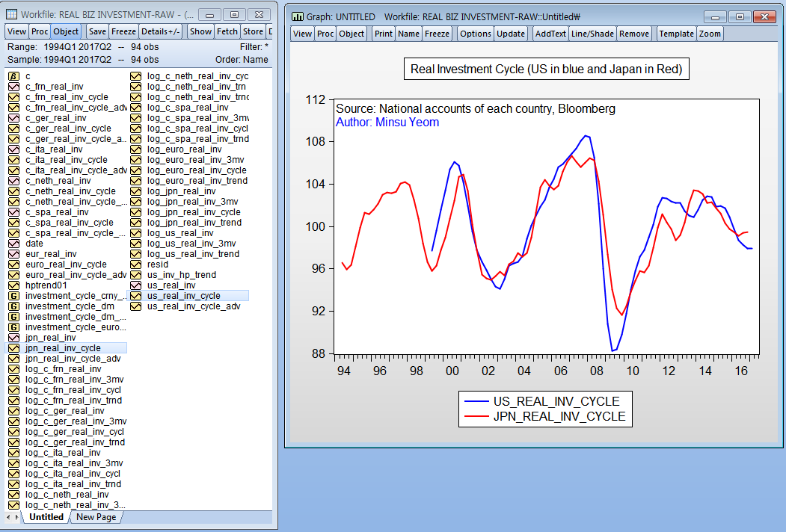
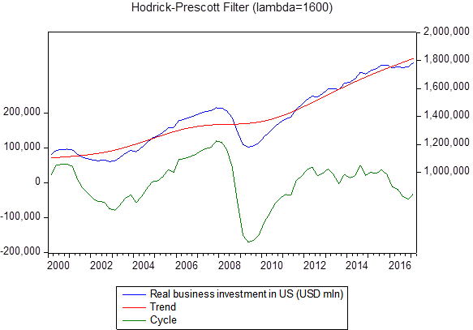
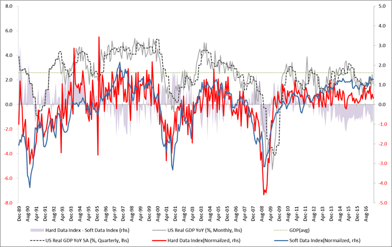
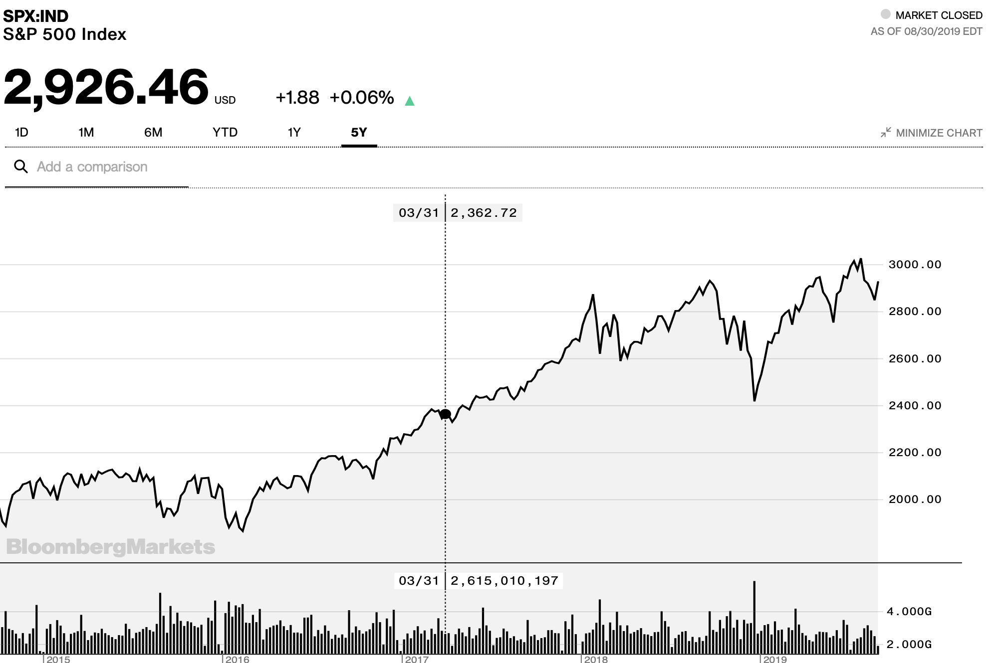
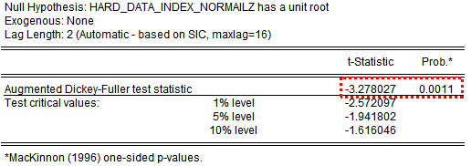
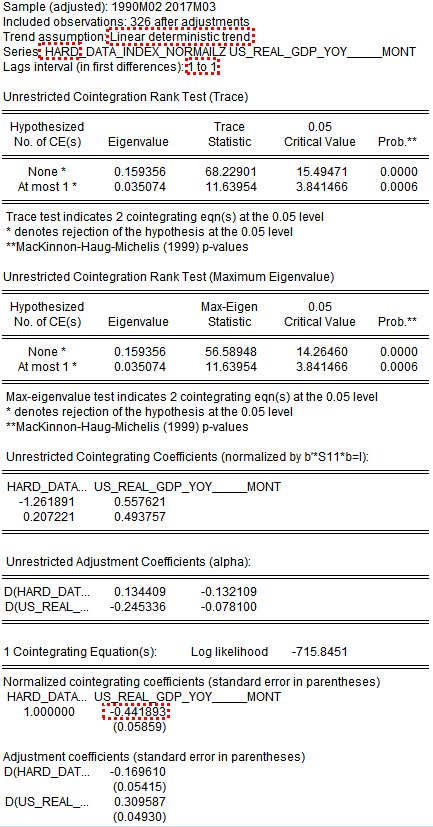
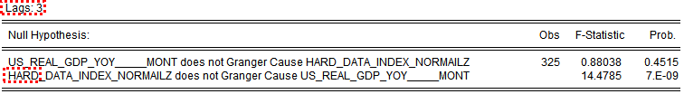
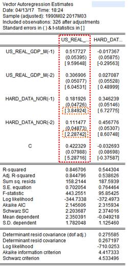
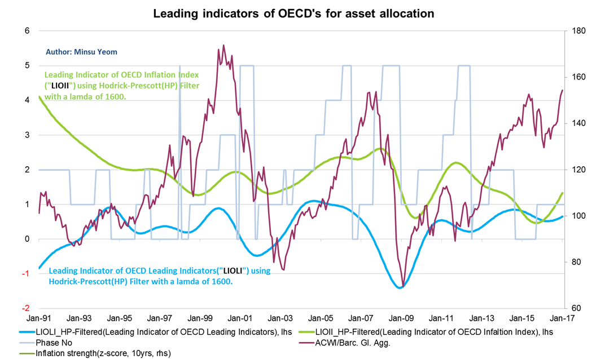

# Macro Analyses for Portfolio Management

I created the following two indicators to make a better investment decision.
- Real investment cycle indicators for U.S, Europe and Japan
- Hard data index and Soft data index for U.S

Statistical techniques applied are:
- Hodrick-Prescott (HP) Filter
- Dickey-Fuller unit root test
- Cointegration test
- Granger Causality test
- VAR Analysis
- PCA Analysis

I used [EViews](https://www.eviews.com/home.html), a well-known statistical package for econometrics, for these analyses.

**Relevant working experience:** March 2013 to July 2018 as a portfolio manager at Korea Investment Management (Seoul, KR)

## I. Real Investment Cycle Indicators
I collected investment data in real terms from the national accounts of each country/region, U.S., Europe and Japan. I excluded investments in construction because I believed it's more relevant to my analysis.

### `WHY` do you have to be able to do this as a portfolio manager?
Aren't *they* do it for you? Who are they? Your in-house or sell-side analysts? Well, yes, they do, and you can even ask them to what you want to do. So why?

To make a long-term investment decision *confidently* in the face of information overload, portfolio managers should have their own ways of supporting their insights with *numbers*, not just ideas. The thinking process that led me to create these indicators from the scratch was in early 2017 :

- Okay, global economy look fine. Earnings seem good. Are they going up in the future as well? Is it yes because what's considered forward-looking survey such as Manufacturing ISM new order index keeps going up recently among (many) others? Is it yes because you've heard about lots of companies in your portfolio expecting growth?

- Let's ask an economist. Do you have an answer? I am not an economist, but I picked private business investments as an essential driver in this forecast. I believed that, at that point of time, if anyone should be right about the future, it must be business firms. If they decide to spend more in fixed investments in aggregated terms, then we would see the bright economic futures.

- So, how can you support this insight? One of my principles is that, *don't ask sell-side analysts* to do an important analysis at the expense of the possibility of information leakage or of lower quality. Also, analyzing it yourself or with in-house analysts would give you a valueable opportunity where you can think it through until you get confidence more and more. You would know quite exactly how confident you are in the end of the day, which is very important when you decide an *investment weight*.

This is why I have been so eager to learn a new analysis technique and apply it, which was at that time a cycle analysis using EViews, and why I am in the MS in data science program. This learning experience always broadens and deepens my knowledge and ability of applying things in a different context in a way I really want. I love it.

Going back to my work, I followed a textbook, classical way of time-series analysis. My assumptions are:
- Y = T + S + C + I,
  - where T: Trend, S: Seasonal, C: Cyclical, I: Irregular
 
 With this assumption, I remove seasonality (by gatering Seasonally Adjusted raw data) and random variations (by 3-month moving average) of my data. Then, I further remove *trend*. EViews helped very much here.

This chart above is not really the final indicator, but this gets you a good sense of how to decompose trend and cycle from the raw data.

Now I tranform it into natural log space. That is, I take *log*(cyclical component). In fact, I apply the HP filter to this transformed-data. I substract this trend component from the time-series data with seasonality and random variations removed. Finally, I take an exponential and then multiply it by 100 to get the final indicator going around 100.

## II. Hard data vs Soft data
### Hard data index, Soft data index and US Real GDP YoY

Again, `WHY` do you need to create your own Hard data index and Soft data index in the first place? You have a well known [Chicago Fed National Activity Index (CFNAI)](https://www.chicagofed.org/research/data/cfnai/current-data)! I have to even admit that I stole the [same methodology](https://www.chicagofed.org/~/media/publications/cfnai/background/cfnai-background-pdf.pdf) that Chicago Fed is currently using to make CFNAI. Are you trying to invest the wheel again? No! I love to reuse the wheel as much as possible, but it's a totally different case.

It was needed because I wanted to make a decision about my betting size (invesetment weights). It all began from this research article on March 28, 2017, ["Does Data Confusion Equal Forecast Confusion?"](https://research.stlouisfed.org/publications/economic-synopses/2017/03/28/does-data-confusion-equal-forecast-confusion/) by St. Louis Fed. Market parcitipants started to debate on 'Hard data vs Soft data' *only after* this research was released. See a [Forbes' posting](https://www.forbes.com/sites/scottanderson/2017/05/01/the-hard-vs-soft-data-debate-rages-on/#6719103f52a1) on May 1, 2017. It's passed more than one month, a very long time, and it was still going on.

- Curious about how the authour's conclusion in the [Forbes' posting](https://www.forbes.com/sites/scottanderson/2017/05/01/the-hard-vs-soft-data-debate-rages-on/#6719103f52a1)? It was "*I think the truth is somewhere in between.*", which I personally take as *no conclusion* at all because it does not extract actionable value from its analysis. How do you adjust your portfolio with this conclusion confidently? How can you explain your trades to your client confidently?

What do you have to do? First of all, you have to recognize it is an important issue. Second of all, you have to be able to analyze on your own (or at least be well-versed enough to ask it internally). Third of all, you can draw a conclusion from the analysis with other evidences, either qualitatively or quantitatively and holistically.

So, I did this analysis on my own as follows, and this was how SPX moved after the big and length debate in 2Q17:

### Statistical techniques applied
Again, EViews was used.

#### Unit root test
My hard data index and soft data index has no unit root so that I concluded that they are *stationary*, where as US Real GDP YoY turned out to be difference stationary (because, surprisingly, differencing the data yields a stationary time-series data).

#### Cointegration test
I found that both pairs of (my hard data index and GDP YoY) and  (soft data index and GDP YoY) are cointegrated, allowing me saftely to move on VAR analysis. If not cointegrated, I would have to differencing my data to build a VAR model.

#### Granger Causality test and VAR Analysis
I argue that two indices have statistical reliabilities in terms of causality as follows:

- Change in Hard data index causes change in US Real GDP YoY Monthly at the significance level of 0.01% for the next 1 through 4 months. (NOT vice versa)
- Change in Soft data index causes change in US Real GDP YoY Monthly at the significance level of 1% for the next 1 through 4 months. (NOT vice versa)

**Granger Causality**

**VAR Analysis**
Denoting US Real GDP Monthly by **GDP** and Hard Data Index(normalized) by **H**, we can set a model that:
GDPt = 0.51GDPt-1 + 0.30GDPt-2 + 0.18Ht-1 + 0.11Ht-2 + 0.42 + et1.

### An application in Asset Allocation

